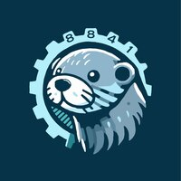
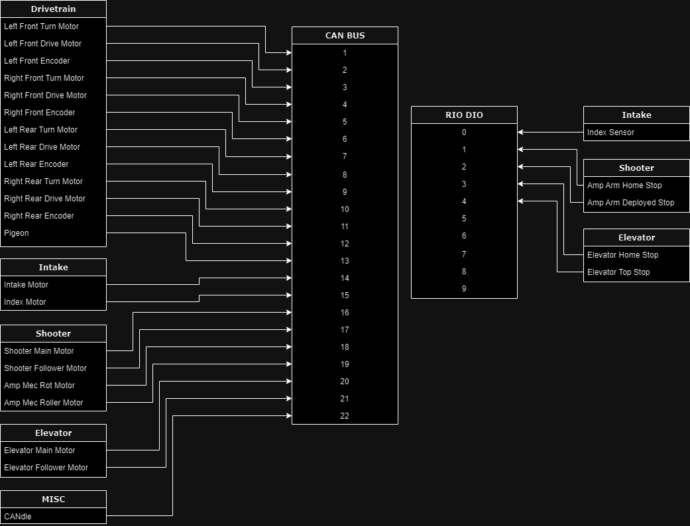

# Team 8841's 2024 Season

This repo contains the code we're writing for the 2024 FRC game and season: [Crescendo](https://www.firstinspires.org/robotics/frc/game-and-season). I'm not really sure what to write here tbh. Trans rights are human rights.

## Documentation

To generate the javadocs run `./gradlew generateDocs` in the root directory of the project. The generated documentation should be put into `build/docs`.

## Building

TBD

## Libraries

[AdvantageKit (Team 6328)](https://github.com/Mechanical-Advantage/AdvantageKit)

[NavX (Kauai Labs)](https://pdocs.kauailabs.com/navx-mxp/software/)

[Pheonix 6 (CTR-Electronics)](https://pro.docs.ctr-electronics.com/en/latest/index.html)

[REVLib (REV Robotics)](https://www.revrobotics.com/software/)

We also used a lot of code from [BaseFalconSwerve (Team 364)](https://github.com/Team364/BaseFalconSwerve/), most notably `src/main/java/frc/lib/**` (basically verbatim) and several other files.
